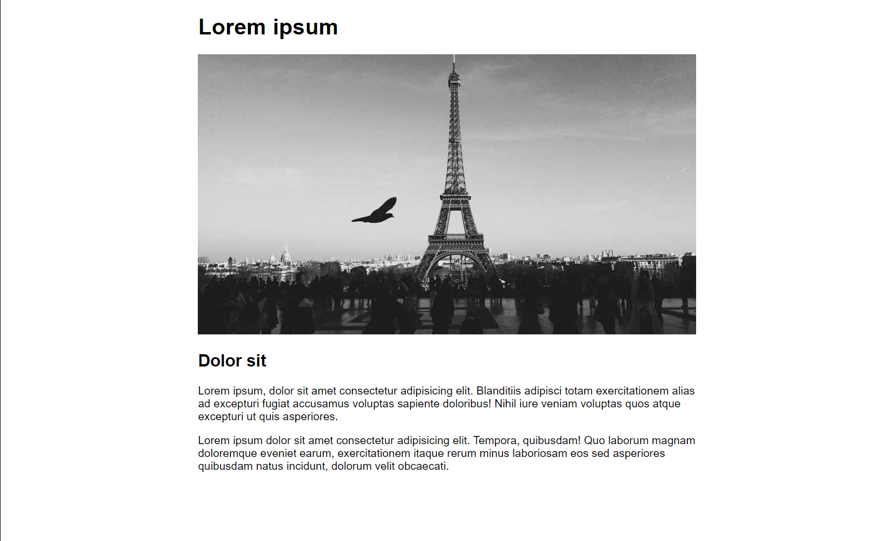

# ulf-projekt-uppgift-2

Skapa en webbsida med **centrerad layout**, sidan bör vara responsiv.

* Main med innehåll
    * Rubrik
    * Bild, ska vara centrerad och fylla hela bredden (responsivt)
    * Underrubrik
    * Paragrafer med text

