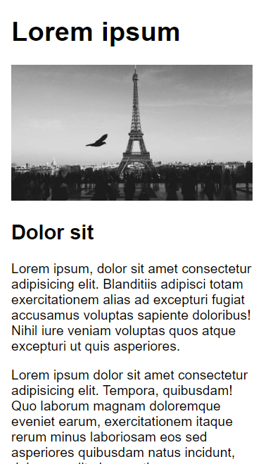

# ulf-projekt-uppgift-2

Skapa en webbsida med **centrerad layout**, sidan bör vara responsiv.

* Main med innehåll
    * Rubrik
    * Bild, ska vara centrerad och fylla hela bredden (responsivt)
    * Underrubrik
    * Paragrafer med text

# Instruktioner

## Parprogrammering

Din uppgift är att skapa en sida med en centrerad layout. Layouten bör fungera för mobiler (responsiv).
Sidan ska innehålla:

* Rubrik: Lorem ipsum
* Hero bild, använd https://picsum.photos/ med 16:9 aspect ratio
* Article element med:
   * Underrubrik: Dolor sit
   * Paragraf: Lorem ipsum block
   * Paragraf: Lorem ipsum block
   
Till det skapar du css i ett separat dokument.

## Parsons

Dina instruktionsfiler finns i mappen [parsons/](parsons/).

Du ska utifrån dessa filera skapa en sida med centrerad layout.
Du behöver redigera båda filerna (index.html och style.css) och ta bort överflödig/onödig/felaktig html/css.

## Flödesschema

Din uppgift är att skapa en sida med en centrerad layout. Layouten bör fungera för mobiler (responsiv).

Material, skisser.

